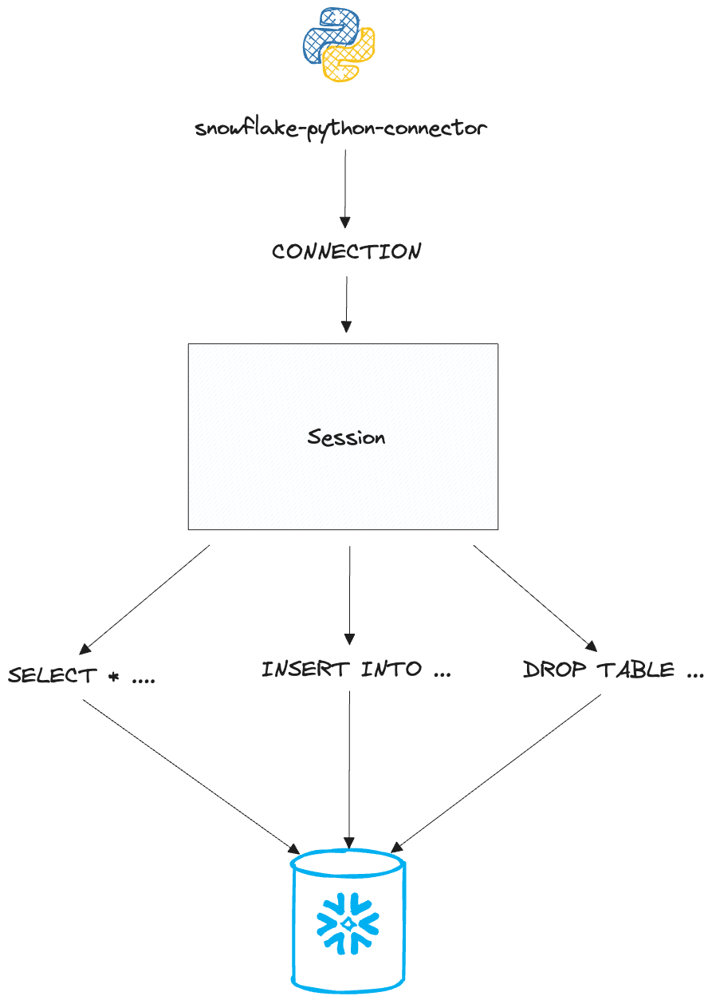
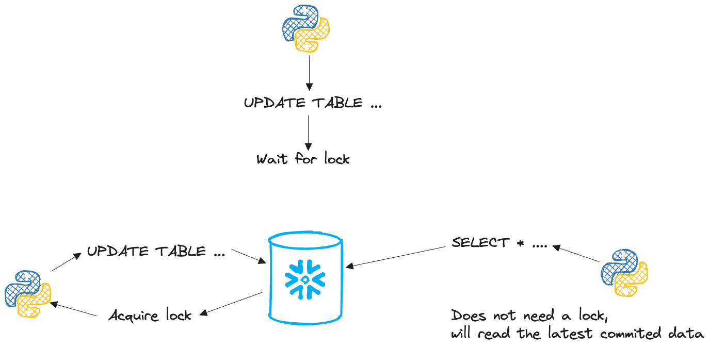
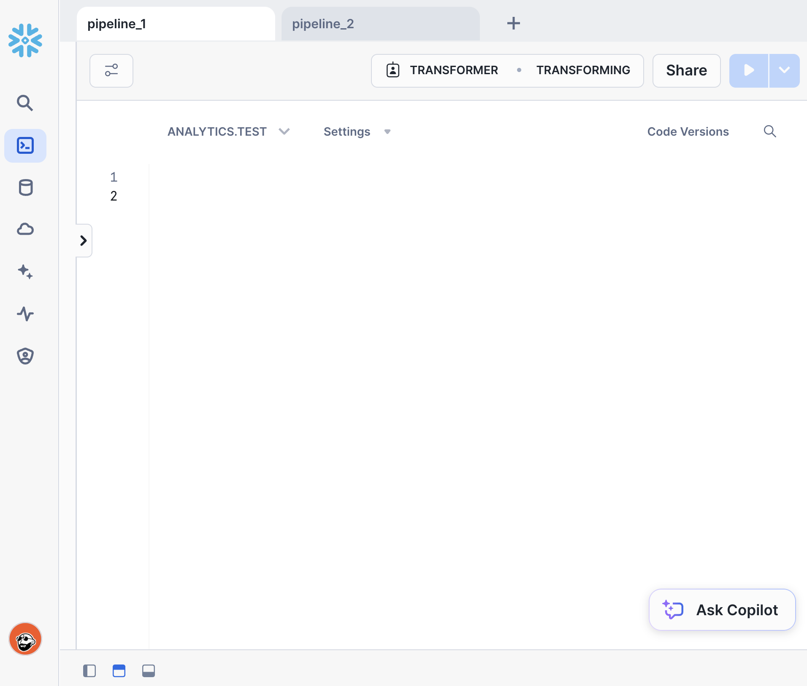
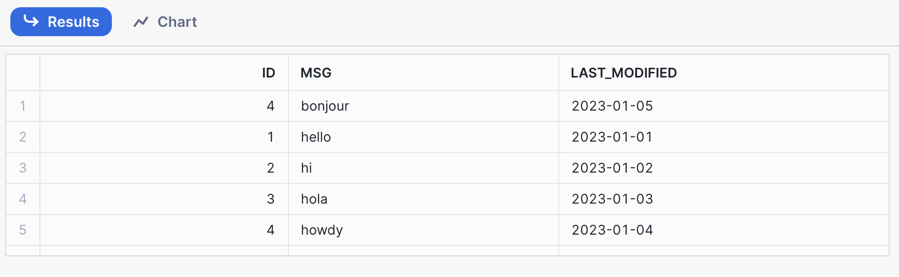

# Understanding Snowflake Table Locks

Table locks are not just for DBAs; data engineers must also understand how to manage concurrent transactions from multiple applications to the same database table. Properly managing table locks is crucial for ensuring data consistency, preventing conflicts, and maintaining the integrity of your data. As data pipelines become more complex and the volume of transactions increases, understanding how table locks work can help data engineers design more robust and reliable data workflows.


## Table locks in Snowflake

Before jumping into locks, let's first state a few important definitions...

- **Session** - A state of information exchange between a client and Snowflake. A session begins after a user has successfully connected and authenticated with Snowflake.
- **Transaction** - A sequence of SQL statements processed as one atomic unit. In other words, either all or none of the statements succeed.
- **Isolation Level** - The degree to which a transaction must be isolated from the data modifications made by another transaction.
- **Read Committed** - Snowflake's only isolation level. Within a transaction, a statement only sees data that has been committed. 

When you create a connection to Snowflake, you start a session. Within that session, you can send transactions to Snowflake. Each transaction is associated with a single session; in other words, transactions cannot be shared across multiple sessions.

<p align="center">
    
</p>

Now, picture a scenario where many applications send transactions to the same Snowflake database throughout the day. What happens when some of those transactions target the same tables at the same time? If we are strictly reading from those tables, then there is nothing to worry about. However, we have to be careful when at least one of those transactions attempts to modify the target table.

This is where locks become important. Transactions acquire locks when they modify a table. These locks prevent other transactions from modifying the table until the lock is released. Most DML operations acquire locks. For example, updates, deletes, and merges cannot run in parallel across different transactions. On the other hand, multiple transactions that perform inserts and copy statements at the same time are allowed.

<p align="center">
    
</p>

Next, let's go through a few examples to see how table locks work in action.


## Setting the stage

To follow along, you'll need a Snowflake account and a table for testing.

In the Snowflake console, open up two worksheets. Each worksheet creates it's own session. We can pretend that each worksheet is a data pipeline sending transactions to a Snowflake table.

<p align="center">
    
</p>

In one of the worksheets, execute the statements in the `code/table.sql` file. These statements will create a `table_locks` table and populate it with a few records.

```sql
CREATE OR REPLACE TABLE table_locks (
    id int,
    msg string,
    last_modified date
);

INSERT INTO table_locks
VALUES
    (1, 'hello', '2023-01-01'),
    (2, 'hi', '2023-01-02'),
    (3, 'hola', '2023-01-03');
```

> You will have to choose a database and schema in the worksheet context so that Snowflake knows where to create the table.
> 
> Alternatively, you can use the fully qualified table name in the statements (e.g. `CREATE OR REPLACE TABLE DATABASE.SCHEMA.TABLE_LOCKS`)

We will walk through several examples of different types of concurrent transactions. After each section, rerun the code in the `code/table.sql` file to revert any changes made.


## Read vs Read

We don't have to worry too much about read-only transactions. Snowflake uses the read-committed isolation level, which ensures that any `SELECT` statement reads the latest committed data. This isolation level prevents dirty reads, meaning a transaction cannot read data that has been modified but not yet committed by another transaction.

To see this in action, run the statements in the `code/read_read.sql` file, in the order specified, in two different worksheets. The `SHOW TRANSACTIONS` and `SHOW LOCKS` commands will help us confirm the state of transactions and locks.

```sql
-- worksheet 1
BEGIN TRANSACTION; -- 1
SHOW TRANSACTIONS; -- 2
SELECT * FROM table_locks; -- 5
SHOW LOCKS; -- 6
COMMIT; -- 9
SHOW TRANSACTIONS; -- 10

-- worksheet 2
BEGIN TRANSACTION; -- 3
SHOW TRANSACTIONS; -- 4
SELECT * FROM table_locks; -- 7
SHOW LOCKS; -- 8
COMMIT; -- 11
SHOW TRANSACTIONS; -- 12
```

Here's what you should observe:
- Although transactions belong to a single session, they are visible to other sessions (you can confirm this using the `SHOW TRANSACTION` statement).
- `SELECT` statements do not acquire any locks.
- Two read-only transactions do not affect what each other sees.

Let's start looking at more interesting examples.


## Read vs Insert

In this example, one session will try to read from our table while another will attempt to insert new rows into the same table.

Similar to our previous example, run the statements in the `code/read_insert.sql` file to follow along.

```sql
-- worksheet 1
BEGIN TRANSACTION; -- 1
SHOW TRANSACTIONS; -- 2
INSERT INTO table_locks
VALUES (4, 'howdy', '2023-01-04'); -- 6
SHOW LOCKS; -- 7
COMMIT; -- 10

-- worksheet 2
BEGIN TRANSACTION; -- 3
SHOW TRANSACTIONS; -- 4
SELECT * FROM table_locks;  -- 5
SHOW LOCKS; -- 8
SELECT * FROM table_locks; -- 9
SELECT * FROM table_locks; -- 11
COMMIT; -- 12
```

At step 6, Worksheet 1 acquires a lock when inserting the new row. Despite this, Worksheet 2 can still read from the table in step 9. Why?

As mentioned before, we don't have to worry too much about locks when reading from a table. Snowflake simply returns the latest committed data at the time of your `SELECT` statement. In the above example, at step 6, the first session hasn't committed the new row. This means that the second session doesn't "see" the new row and returns the table in it's state before the first session began it's transaction. 

However, as confirmed by steps 7 and 8, the first session does indeed acquire a lock on the `table_locks` table. When inserting data into a Snowflake table, new micropartitions are created to store it. These new partitions are locked, not visible, and cannot be modified by other transactions while the lock is in effect. So, while the second session has access to the `table_locks` table, it cannot read the newly created partitions containing the new record until the first session commits it's changes (and releases the lock).


## Read vs Update

Let's explore what happens when one session tries to read from a table while another session updates it.

To follow along, run the statements in the `code/read_update.sql` file.

```sql
-- worksheet 1
BEGIN TRANSACTION; -- 1
SHOW TRANSACTIONS; -- 2
UPDATE table_locks
    SET msg = 'bonjour'
    WHERE id = 3; -- 6
SHOW LOCKS; -- 7
COMMIT; -- 10

-- worksheet 2
BEGIN TRANSACTION; -- 3
SHOW TRANSACTIONS; -- 4
SELECT * FROM table_locks;  -- 5
SHOW LOCKS; -- 8
SELECT * FROM table_locks; -- 9
SELECT * FROM table_locks; -- 11
COMMIT; -- 12
```

When Worksheet 2 reads the table at step 5, it sees the original data, as the update in Worksheet 1 has not yet been committed. The modified row (`msg = 'bonjour'`) is not visible to Worksheet 2 until Worksheet 1 commits the transaction at step 10.

Snowflake's behavior here ensures data consistency by isolating the transactions. The lock acquired by Worksheet 1 during the update prevents other sessions from seeing uncommitted changes. Instead, Worksheet 2 continues to read from the old version of the data (`msg = 'hola'`) until the update is committed.


## Insert vs Insert

Let's work through the two scenarios found in the `code/insert_insert.sql` file.

In the first, we have two transactions attempting to simultaneuosly insert different rows in the same table. 

```sql
/* Scenario 1 - Non overlapping */

-- worksheet 1
BEGIN TRANSACTION; -- 1
SHOW TRANSACTIONS; -- 2
INSERT INTO table_locks
VALUES (4, 'howdy', '2023-01-04'); --5
SELECT * FROM table_locks; -- 6
SHOW LOCKS; -- 7
SELECT * FROM table_locks -- 11
COMMIT; -- 12

-- worksheet 2
BEGIN TRANSACTION; -- 3
SHOW TRANSACTIONS; -- 4
SELECT * FROM table_locks; -- 8
INSERT INTO table_locks
VALUES (5, 'bonjour', '2023-01-05'); -- 9
SELECT * FROM table_locks; -- 10
SELECT * FROM table_locks; -- 13
COMMIT; -- 14
```

Remember, `INSERT` statements only acquire a lock on the partition(s) containing the new records. For this reason, both statements are able to run in parallel.

In the above example, there isn't any data collision between the inserted rows. But what happens when we try to insert equivalent rows, or records that would violate a primary key constraint? Let's find out by running the next scenario where different rows try to use the same primary key (id) value. 

```sql
/* Scenario 2 - Overlapping */

-- worksheet 1
BEGIN TRANSACTION; -- 1
SHOW TRANSACTIONS; -- 2
INSERT INTO table_locks
VALUES (4, 'howdy', '2023-01-04'); --5
SELECT * FROM table_locks; -- 6
SHOW LOCKS; -- 7
SELECT * FROM table_locks -- 11
COMMIT; -- 12

-- worksheet 2
BEGIN TRANSACTION; -- 3
SHOW TRANSACTIONS; -- 4
SELECT * FROM table_locks; -- 8
INSERT INTO table_locks
VALUES (4, 'bonjour', '2023-01-05'); -- 9
SELECT * FROM table_locks; -- 10
SELECT * FROM table_locks; -- 13
COMMIT; -- 14
```

The locks behave as expected, however, we end up with a primary key constraint violation.

<p align="center">
    
</p>

Unfortunately, relying solely on isolation levels and table locks won't prevent data duplication. However, the scenario we presented is somewhat unrealistic and should not cause much concern. In practice, we typically do not create row identifiers like primary keys when ingesting data from raw sources. Data pulled from databases, APIs, and other sources usually contains keys or a combination of columns that uniquely identify each row. To mitigate the risk of duplicate data, we should design our data pipelines to minimize the likelihood of different pipelines inserting the same data into a table.


## Update vs Update

For our final example, we look at what happens when two transactions try to simultaneously update the same table. 

Run the `code/update_update.sql` code to follow along.

```sql
-- worksheet 1
BEGIN TRANSACTION; -- 1
SHOW TRANSACTIONS; -- 2
UPDATE table_locks
    SET msg = 'bonjour'
    WHERE id = 3; -- 5
SHOW LOCKS; -- 6
COMMIT; -- 9

-- worksheet 2
BEGIN TRANSACTION; -- 3
SHOW TRANSACTIONS; -- 4
UPDATE table_locks
    SET msg = 'howdy'
    WHERE id = 2; -- 7
SHOW LOCKS; -- 8
COMMIT; -- 10
```

You should have noticed that the update in Worksheet 2 (step 7) does not execute until the transaction in Worksheet 1 is committed. This is due to the fact that when an `UPDATE`, `MERGE`, or `DELETE` statement is executed, a lock is acquired on the affected partitions (this could be the entire table). These locks prevent other transactions from modifying the same rows simultaneously.

This behavior is crucial for maintaining data accuracy, as it ensures that no two transactions can update the same row at the same time, which could lead to conflicts or inconsistent data. By serializing these operations, Snowflake ensures that each transaction sees a consistent view of the data and that all changes are applied in a controlled manner.


## Final Thoughts

Table locks play a crucial role in maintaining data quality when dealing with concurrent transactions. By ensuring that only one transaction can modify a specific row at a time, Snowflake helps prevent conflicts and ensures data consistency. Understanding how table locks work, along with other database concepts like isolation levels, is essential for data engineers, especially when building data pipelines that move data into Snowflake.

I encourage you to continue experimenting with different scenarios. Try out concurrent `DELETE`, `MERGE`, and `INSERT OVERWRITE` statements to see how Snowflake handles them. Each scenario will give you deeper insights into how Snowflake manages concurrency and ensures data integrity.

Remember, mastering these concepts will make you more effective in designing and implementing robust data pipelines. By fully grasping the importance of table locks and isolation levels, you'll be better equipped to handle the complexities of concurrent transactions, ultimately ensuring the reliability and accuracy of your data workflows. Happy experimenting!
